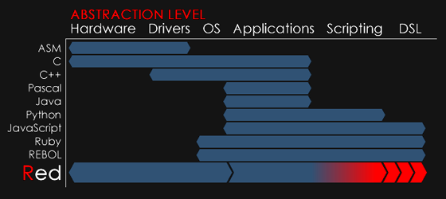

Title: 為什麼要學習計算機程式?
Date: 2017-01-18 11:00
Category: Course
Tags: programming, w2
Slug: why-computer-programming
Author: yen

車輛工程系學習計算機程式做什麼?

<!-- PELICAN_END_SUMMARY -->

1. (電動汽車世代來臨) - 隨著現代汽車傳動控制的電子化、電機化、網路化與智能化, 計算機程式相關技術在汽車領域的應用將會愈來愈重要.

2. (電腦輔助設計普及) - 現代汽車的協同設計研發大量採用 Computer Aided Design (CAD, 利用電腦實現設計的具像表達, 直接建構模擬系統或 API 延伸), Finite Element Analysis (利用電腦實現設計的強度與碰撞分析), Data Acquisition (數據擷取), and Numerical Analysis (數值分析). 

3. (虛擬與擴增實境整合) - 現代汽車行路對於網路化與數位化地圖與即時路況資料的依賴愈來愈多, 這些資料需要透過許多電腦程式的整合運行.

Python 為解譯式、泛用型程式語言

Python 可以作為互動式計算機

Python 語法可以透過 Brython, 直接在瀏覽器中執行

Python 可以直接在 Jupyterlab 環境中執行

計算機程式抽象層級:

Controller Area Network (CAN)

<a href="https://github.com/hardbyte/python-can">https://github.com/hardbyte/python-can</a>

<a href="http://spectrum.ieee.org/automaton/robotics/artificial-intelligence/how-google-self-driving-car-works">http://spectrum.ieee.org/automaton/robotics/artificial-intelligence/how-google-self-driving-car-works</a>

<iframe width="560" height="315" src="https://www.youtube.com/embed/YXylqtEQ0tk" frameborder="0" allowfullscreen></iframe> (2011)

<iframe width="560" height="315" src="https://www.youtube.com/embed/7Yd9Ij0INX0" frameborder="0" allowfullscreen></iframe> (2013)

<iframe width="560" height="315" src="https://www.youtube.com/embed/yPCt7mu-pb0" frameborder="0" allowfullscreen></iframe> (2013)

<iframe width="560" height="315" src="https://www.youtube.com/embed/nL-CqMenOqQ" frameborder="0" allowfullscreen></iframe> (2013)

<iframe width="560" height="315" src="https://www.youtube.com/embed/czLI3oLDe8M" frameborder="0" allowfullscreen></iframe> (2014)

<iframe width="560" height="315" src="https://www.youtube.com/embed/wPHq4LYNmRY" frameborder="0" allowfullscreen></iframe> (2015)

<iframe width="560" height="315" src="https://www.youtube.com/embed/3dXQxSI3XDY" frameborder="0" allowfullscreen></iframe> (2016)

<iframe width="560" height="315" src="https://www.youtube.com/embed/GE32Vvt-flM" frameborder="0" allowfullscreen></iframe> (2017)

<iframe width="560" height="315" src="https://www.youtube.com/embed/5izIed9nGdo" frameborder="0" allowfullscreen></iframe> (2017)

<a href="http://blog.teamtreehouse.com/havent-started-programming-yet">http://blog.teamtreehouse.com/havent-started-programming-yet</a>

if computers are at all a part of your life, then learning to program is going to improve your life.

Learning to program can make you more productive, efficient and effective.

<a href="http://theconversation.com/why-everyone-should-have-to-learn-computer-programming-62328">http://theconversation.com/why-everyone-should-have-to-learn-computer-programming-62328</a>

數位化系統 (電腦) 無所不在, 希望高效且客製化運用這些系統, 就必須學習與電腦溝通

<a href="https://www.codementor.io/learn-programming/beginner-programming-language-job-salary-community">https://www.codementor.io/learn-programming/beginner-programming-language-job-salary-community</a>

<a href="http://cacm.acm.org/blogs/blog-cacm/176450-python-is-now-the-most-popular-introductory-teaching-language-at-top-u-s-universities/fulltext">http://cacm.acm.org/blogs/blog-cacm/176450-python-is-now-the-most-popular-introductory-teaching-language-at-top-u-s-universities/fulltext</a>