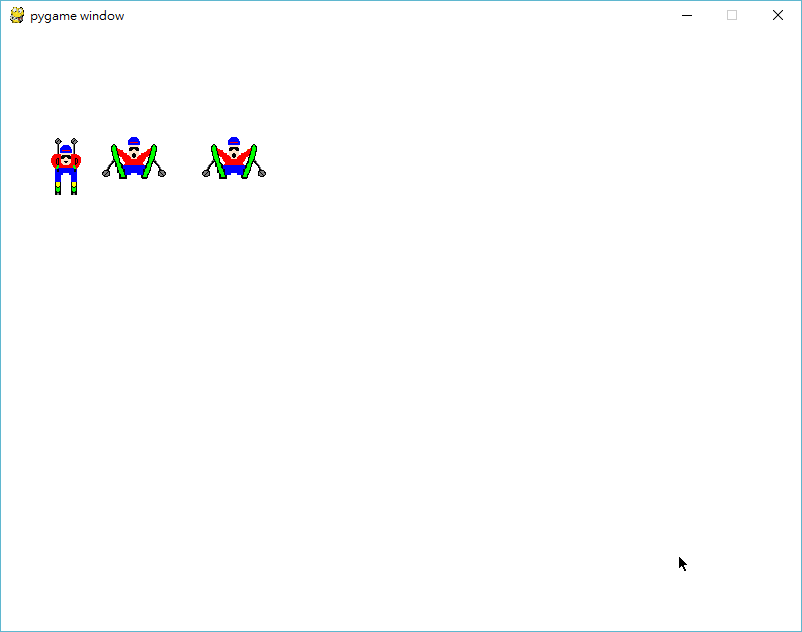

Title: W14 - Pygame 程式模組
Date: 2017-05-26 11:00
Category: Course
Tags: Pygame, w14
Slug: w14-starting-pygame
Author: yen

本週進行 Pygame 模組的安裝與簡介

<!-- PELICAN_END_SUMMARY -->

## 安裝 Pygame

python -m pip install pygame

<a href="./../data/w14/vcp_portable.7z">下載</a>已經安裝 Pygame 的可攜程式系統

## 範例程式

<pre class="brush: python">
#vcpw14-1.py 需要 skier_down.png 與 skier_crash.png 兩個圖檔才能執行
import pygame
# 載入圖檔
skier= pygame.image.load('skier_down.png')
skier2= pygame.image.load('skier_crash.png')
# 設定影幕尺寸
screen = pygame.display.set_mode((800, 600))
# 填入白色
screen.fill([255, 255, 255])
# 設定時間追蹤物件
clock = pygame.time.Clock()
# 在螢幕中特定位置畫出 skier
screen.blit(skier, (50, 100))
screen.blit(skier2, (100, 100))
screen.blit(skier2, (200, 100))
# 準備執行迴圈
running = True
while running:
    clock.tick(30)
    for event in pygame.event.get():
        if event.type == pygame.QUIT: 
            running = False
    pygame.display.flip()
</pre>

執行結果:

<a href="./../data/w14/vcpw14-1.7z">下載</a> 上述 vcpw14-1.7z 程式範例.

<a href="./../data/w14/Skier.7z">下載  Skier.7z</a>

<a href="./../data/w14/PythonBattle.7z">下載  PythonBattle.7z</a>

<a href="./../data/w14/PyPong.7z">下載  PyPong.7z</a>

<a href="./../data/w14/LunarLander.7z">下載  LunarLander.7z</a>
